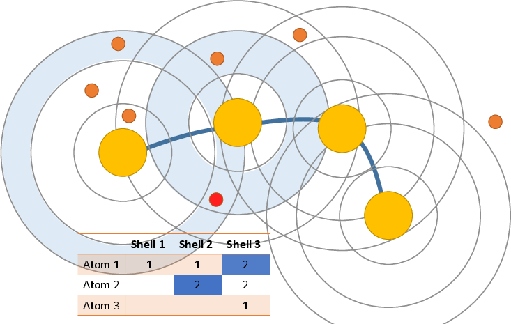

Introduction
============

This package allows you to featurize molecular dynamics trajectories that
include solvent or other indistinguishable particles. 

 - Construct a set of shells around each "solute atom"

 - Calculate the density of solvent in each shell for each frame of the
   trajectory

From these features, you can transform the features via tICA and build an
MSM as usual. 

We recommend using about 4 shells of width 3 Angstrom.

